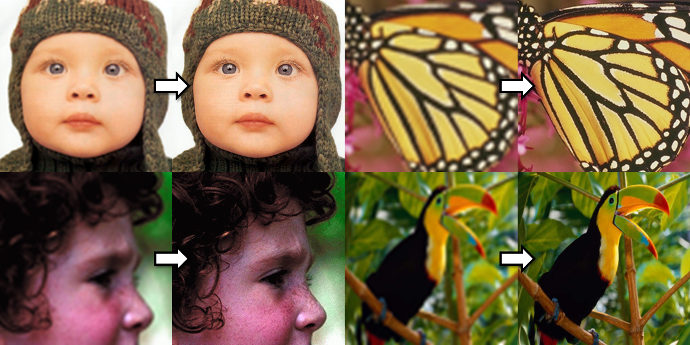
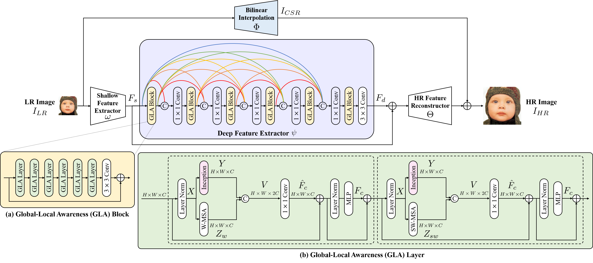
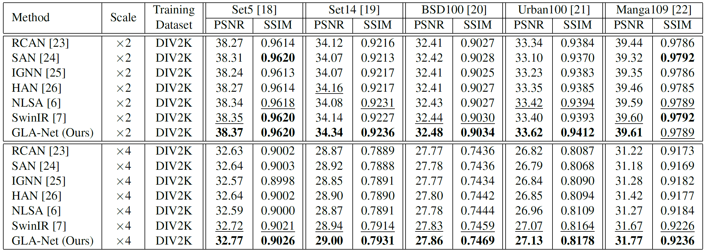
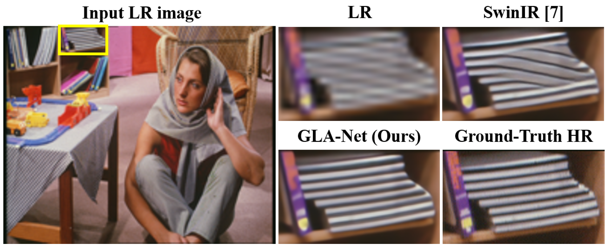
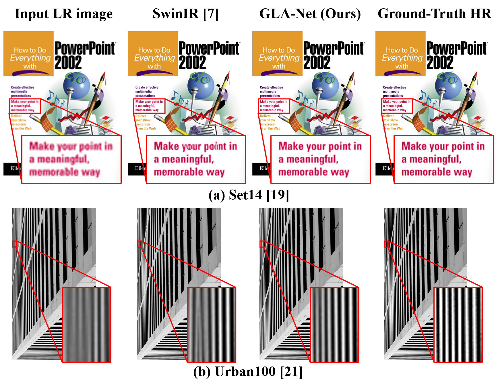
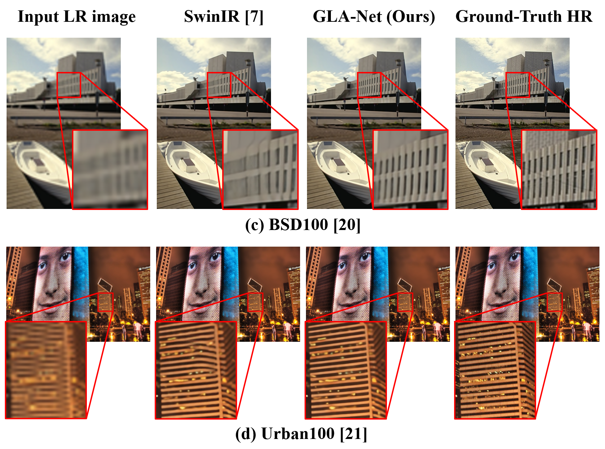
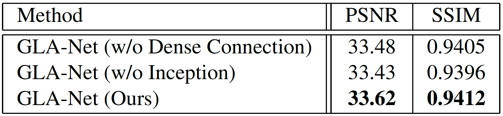
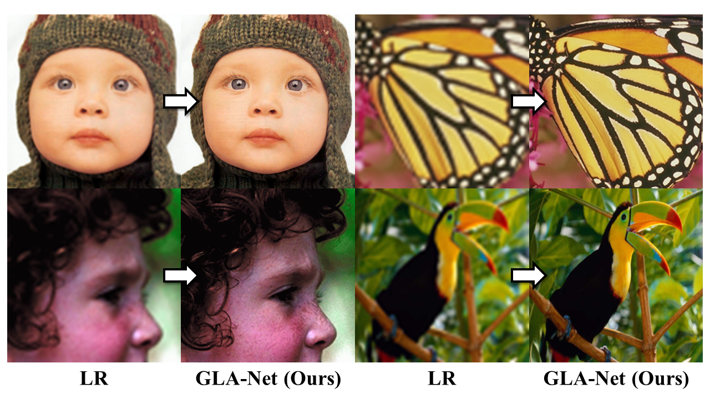

# Global-Local Awareness Network For Image Super-Resolution [ICIP 2023]

This repository is the official PyTorch implementation of Global-Local Awareness Network For Image Super-Resolution.

Our **G**lobal-**L**ocal **A**wareness **N**etwork (GLA-Net) is to effectively 
capture global and local information to learn comprehensive
features with low- and high-frequency information.



## Abstract
> Deep-net models based on self-attention, such as Swin Trans former, have achieved great success for single image super resolution (SISR). While self-attention excels at modeling global information, it is less effective at capturing high frequencies (e.g., edges etc.) that deliver local information primarily, which is crucial for SISR. To tackle this, we propose a global-local awareness network (GLA-Net) to effectively capture global and local information to learn comprehensive features with low- and high-frequency information. First, we
Design a GLA layer that combines a high-frequency-oriented Inception module with a low-frequency-oriented Swin Trans former module to simultaneously process local and global information. Second, we introduce dense connections in between GLA blocks to strengthen feature propagation and alleviate the vanishing-gradient problem, where each GLA block is composed of several GLA layers. By coupling these
core designs, GLA-Net achieves SOTA performance on SISR.


## Getting Started 
```bash
# Clone the repo:
git clone https://github.com/PANpinchi/GLA-Net_release.git

cd GLA-Net_release
```
## Download the Required Data
#### 1. Pre-trained Models
You can download the pre-trained GLA-Net model from [here](https://drive.google.com/drive/folders/1m4In2Ldx4gZtS_WAap7AIbvP5iGwMDwu?usp=drive_link) and put them in `/pretrained_models`.

#### 2. Datasets
Used training and testing sets can be downloaded as follows:
| Task               |                               Training Set                               |                                                                     Testing Set                                                                     |   
|:------------------:|:------------------------------------------------------------------------:|:---------------------------------------------------------------------------------------------------------------------------------------------------:|
| classical image SR | [DIV2K](https://data.vision.ee.ethz.ch/cvl/DIV2K/) (800 training images) | Set5 + Set14 + BSD100 + Urban100 + Manga109 [[Download All]](https://drive.google.com/drive/folders/1rXGfO6yvXBzYL7UuZF0XrAwhqIs_fTma?usp=drive_link) |

You need to unzip the contents and put them in `/trainsets` and `/testsets`.

#### The data directory structure should follow the below hierarchy.
```
${ROOT}
|-- pretrained_models
|   |-- GLA-Netx2.pth
|   |-- GLA-Netx3.pth
|   |-- GLA-Netx4.pth
|-- trainsets  
|   |-- trainH
|   |   |-- 0001.png
|   |   |-- 0002.png
|   |   |-- 0003.png
|   |   |-- ...
|   |   |-- 0800.png
|   |-- trainL
|   |   |-- X2
|   |   |   |-- 0001x2.png
|   |   |   |-- 0002x2.png
|   |   |   |-- 0003x2.png
|   |   |   |-- ...
|   |   |   |-- 0800x2.png
|   |   |-- X3
|   |   |   |-- 0001x3.png
|   |   |   |-- 0002x3.png
|   |   |   |-- 0003x3.png
|   |   |   |-- ...
|   |   |   |-- 0800x3.png
|   |   |-- X4
|   |   |   |-- 0001x4.png
|   |   |   |-- 0002x4.png
|   |   |   |-- 0003x4.png
|   |   |   |-- ...
|   |   |   |-- 0800x4.png
|-- testsets
|   |-- BSD100
|   |-- Manga109
|   |-- Set5
|   |-- Set14
|   |-- Urban100
```

## Testing
#### Run the commands below to testing a pretrained model on testing set.
#### 2× Super-Resolution
```bash
# Set5
python main_test_glanet.py --task classical_sr --scale 2 --training_patch_size 48 --folder_lq testsets/Set5/LR_bicubic/X2 --folder_gt testsets/Set5/HR --model_path pretrained_models/GLA-Netx2.pth
# Set14
python main_test_glanet.py --task classical_sr --scale 2 --training_patch_size 48 --folder_lq testsets/Set14/LR_bicubic/X2 --folder_gt testsets/Set14/HR --model_path pretrained_models/GLA-Netx2.pth
# BSD100
python main_test_glanet.py --task classical_sr --scale 2 --training_patch_size 48 --folder_lq testsets/BSD100/LR_bicubic/X2 --folder_gt testsets/BSD100/HR --model_path pretrained_models/GLA-Netx2.pth
# Urban100
python main_test_glanet.py --task classical_sr --scale 2 --training_patch_size 48 --folder_lq testsets/Urban100/LR_bicubic/X2 --folder_gt testsets/Urban100/HR --model_path pretrained_models/GLA-Netx2.pth
# Manga109
python main_test_glanet.py --task classical_sr --scale 2 --training_patch_size 48 --folder_lq testsets/Manga109/LR_bicubic/X2 --folder_gt testsets/Manga109/HR --model_path pretrained_models/GLA-Netx2.pth
```
#### 3× Super-Resolution
```bash
# Set5
python main_test_glanet.py --task classical_sr --scale 3 --training_patch_size 48 --folder_lq testsets/Set5/LR_bicubic/X3 --folder_gt testsets/Set5/HR --model_path pretrained_models/GLA-Netx3.pth
# Set14
python main_test_glanet.py --task classical_sr --scale 3 --training_patch_size 48 --folder_lq testsets/Set14/LR_bicubic/X3 --folder_gt testsets/Set14/HR --model_path pretrained_models/GLA-Netx3.pth
# BSD100
python main_test_glanet.py --task classical_sr --scale 3 --training_patch_size 48 --folder_lq testsets/BSD100/LR_bicubic/X3 --folder_gt testsets/BSD100/HR --model_path pretrained_models/GLA-Netx3.pth
# Urban100
python main_test_glanet.py --task classical_sr --scale 3 --training_patch_size 48 --folder_lq testsets/Urban100/LR_bicubic/X3 --folder_gt testsets/Urban100/HR --model_path pretrained_models/GLA-Netx3.pth
# Manga109
python main_test_glanet.py --task classical_sr --scale 3 --training_patch_size 48 --folder_lq testsets/Manga109/LR_bicubic/X3 --folder_gt testsets/Manga109/HR --model_path pretrained_models/GLA-Netx3.pth
```
#### 4× Super-Resolution
```bash
# Set5
python main_test_glanet.py --task classical_sr --scale 4 --training_patch_size 48 --folder_lq testsets/Set5/LR_bicubic/X4 --folder_gt testsets/Set5/HR --model_path pretrained_models/GLA-Netx4.pth
# Set14
python main_test_glanet.py --task classical_sr --scale 4 --training_patch_size 48 --folder_lq testsets/Set14/LR_bicubic/X4 --folder_gt testsets/Set14/HR --model_path pretrained_models/GLA-Netx4.pth
# BSD100
python main_test_glanet.py --task classical_sr --scale 4 --training_patch_size 48 --folder_lq testsets/BSD100/LR_bicubic/X4 --folder_gt testsets/BSD100/HR --model_path pretrained_models/GLA-Netx4.pth
# Urban100
python main_test_glanet.py --task classical_sr --scale 4 --training_patch_size 48 --folder_lq testsets/Urban100/LR_bicubic/X4 --folder_gt testsets/Urban100/HR --model_path pretrained_models/GLA-Netx4.pth
# Manga109
python main_test_glanet.py --task classical_sr --scale 4 --training_patch_size 48 --folder_lq testsets/Manga109/LR_bicubic/X4 --folder_gt testsets/Manga109/HR --model_path pretrained_models/GLA-Netx4.pth
```

## Results
We use the DIV2K dataset as training set and adopt benchmark datasets including Set5, Set14, BSD100, Urban100, and Manga109 for evaluation. We compare the proposed GLA-Net with several leading methods including, RCAN, SAN, IGNN, HAN, NLSA, and SwinIR. PSNR and SSIM are adopted as standard evaluation metrics.

<details>
    <summary>Quantitative Comparison (click me)</summary>
    <p align="center">
      
    </p>
</details>
<details>
    <summary>Visual Comparison (click me)</summary>
    <p align="center">
      
    </p>
</details>
<details>
    <summary>Qualitative Comparison - ×2 (click me)</summary>
    <p align="center">
      
    </p>
</details>
<details>
    <summary>Qualitative Comparison - ×4 (click me)</summary>
    <p align="center">
      
    </p>
</details>
<details>
    <summary>Ablation Study (click me)</summary>
    <p align="center">
      
    </p>
</details>
<details>
    <summary>More Results (click me)</summary>
    <p align="center">
      
    </p>
</details>

## Citation
```bibtex
@inproceedings{PanHsuWeiLin2023glanet,
    title = {GLOBAL-LOCAL AWARENESS NETWORK FOR IMAGE SUPER-RESOLUTION},
    author = {Pan, Pin-Chi and Hsu, Tzu-Hao and Wei, Wen-Li and Lin, Jen-Chun},
    booktitle = {2023 IEEE International Conference on Image Processing (ICIP)},
    month = {October},
    year = {2023}
}
```

## Acknowledgement
The codes are based on [Swin Transformer](https://github.com/microsoft/Swin-Transformer) and [KAIR](https://github.com/cszn/KAIR) and [SwinIR](https://github.com/JingyunLiang/SwinIR). Please also follow their licenses. Thanks for their awesome works.

